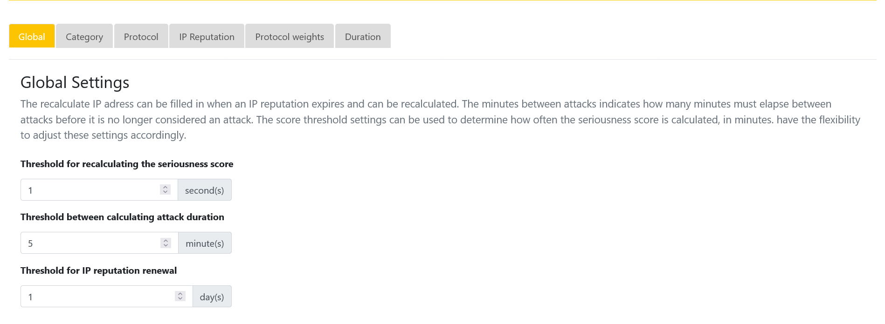

<p align="center">

</p>

# HoneyShield Industrial
This readme provides an overview of the HoneyShield Industrial project. The functionalities and effectiveness are shown and described in this readme.

HoneyShield Industrial is a project that is part of the research group [INTERSECT](https://intersct.nl/).

The focus of the HoneyShield project was investigating the use of a seriousness score in combination with a honeypot in industrial environments. 

>"A honeypot is a cybersecurity technique that involves setting up a deceptive system or network to attract potential attackers. It acts as a decoy, allowing security professionals to gather information about attack techniques, patterns, and motives while safeguarding real production systems from malicious activities."

In this readme you will find information on how to setup the project for yourself and use the seriousness score dashboard.

The HoneyShield provides detailed information on attackers. The detailed information contains information such as the source IP, payload, target port and protocol, geo location and the duration of the attack(s).

## Prerequisites

**Docker (compose)**

Before starting with the installation of the project, Docker and Docker compose are required. Use the official installation guide of Docker to install the required docker instance for your environment. 
    
>[Docker installation](https://docs.docker.com/engine/install/)  
>[Docker compose installation](https://docs.docker.com/compose/install/)

**API key**  
In order to retrieve IP reputation data, an account at [IPQualityScore™](https://www.ipqualityscore.com/) is needed. There, an API key can be requested that should be submitted in the docker compose file. Documentation about IPQualityScore, the API and how to get an API key can be found [here](https://www.ipqualityscore.com/documentation/proxy-detection/overview).

## Installation

**Ports**  
The project, specifically Conpot uses multiple ports to listen on. These ports are used to detect attacks on multiple protocols. Best practice is to port forward these ports and make sure they are accessible from the desired network. 

The ports used by Conpot are:

- TCP/102       S7Comm
- TCP/80        HTTP
- TCP/44818     Ethernet/IP
- TCP/21        FTP
- TCP/502       Modbus
- UDP/69        TFTP
- UDP/161       SNMP  
- UDP/47808     BACNet

Modifying these ports is not recommended as they serve as the default ports for their respective protocols. By default, the dashboard is available on port 5000.

**Compose config**  
The containers can be started using a Docker compose file. You use the Docker compose file example from the repository. Therefore, copy the [docker-compose.yml.example](docker-compose.yml.example) to docker-compose.yml and fill in the empty environment variables. Make sure the MYSQL variables are the same for all the containers.

*MYSQL variables*
```
- MYSQL_DATABASE=<database name>
- MYSQL_USER=<database user>
- MYSQL_PASSWORD=<database password>
- MYSQL_ROOT_PASSWORD=<database root password>
- MYSQL_HOST=<database container name>
```
*Dashboard variables*
```
- APP_USER=<dashboard username>
- APP_PASS=<dashboard password>
- APP_SSL=<dashboard SSL value=TRUE/FALSE>
- PRIVATE_IPS=<Include private IPS value=TRUE/FALSE>
```
*Required API key*
```
- API_KEY=<IPQualityScore apikey>
```

**Starting the stack**  
After completing the prerequisites and the Docker compose file you can start with building the images and starting the docker stack.  

Follow these steps to clone the project and build the images.

1. Clone the Github repository using the following command.  
`git clone https://github.com/nielsbakkers/HoneyShield`

2. After cloning the repository make sure you are in the correct directory. This should be the main directory of the repository. From here run the following commands:
    ```
    docker build -t honeyshield-dashboard Dashboard/.
    docker build -t honeyshield-database Database/.
    docker build -t honeyshield-conpot Conpot/.
    docker build -t honeyshield-listener Listener/.
    ```

After building the images you can easily start the Docker stack using the following command:
`docker-compose up`

## Usage

**Logging in**

After deploying the stack, the dashboard is available at either

> https://\<ip>:5000

or

> http://\<ip>:5000

based on the `APP_SSL` variable in the docker compose file. To login, use the username and password configured using the variables `APP_USER` and `APP_PASS`.


## **The dashboard**

After a successfull login you will be redirected to the main dashboard.  


**Timeframe Selection**

Users can change the timeframe of the results to view attacks within a specific time range. The available options are 1 hour, 1 day, and 1 month. This allows users to focus on particular time periods and observe trends over time.

**Heatmap**

The dashboard displays a heatmap, which visually represents the cumulative seriousness of attacks on a specific location within the selected timeframe.

**Attack Table**

The dashboard presents a table that provides detailed information about the attacks. The table includes the following columns:

- ID: A unique identifier for each attacker.
- Score: The calculated seriousness score of the attacker.
- Attributes: Specific attributes or characteristics of the attacker.
- Duration: The duration of the attack(s).
- IP Bad Reputation: Information about the reputation of the attacking IP.
- Country Code: The country code associated with the attacking IP.
- City: The city associated with the attacking IP.
- Protocols: The protocol(s) used in the attack(s).
- IP Reputation Score: The reputation score of the attacking IP.
- Duration Score: The score calculated based on the duration of the attack(s).
- Protocol Score: The score calculated based on the protocol(s) used in the attack(s).

**Search Bar**

The dashboard includes a search bar that allows users to search for specific (key)words within the attack table. This feature enables users to quickly find and analyse specific attacks or attributes.


## **Attacker details**

The main dashboard allows users to further explore a specific attacker by clicking on its ID.

The attacker page provides the following information:

- Attacker ID: A unique identifier for the attacker.
- Country: The country associated with the attacker's IP.
- City: The city associated with the attacker's IP.
- Seriousness Score: The calculated seriousness score of the attacker.
- Protocols: The protocol(s) used in the attack(s) by the attacker.
- Duration of Attack: The duration of the attack(s).
- IP Reputation: Information about the reputation of the attacker's IP.
- Attributes: Additional attributes associated with the attacker, such as proxy, VPN, or bot.


- Geolocation Map: A map displaying the geolocation linked to the attacker's IP address.

- Seriousness Score Chart: A chart showing the seriousness score of the attacker over time.


 

The attacker page also includes a table that shows each individual request associated with the attacker. 
The table contains the following columns:

- ID: A unique identifier for each request.
- Destination Port: The port targeted in the request.
- Protocol: The protocol used in the request.
- Request: The request sent by the attacker.
- Response: The response sent by the honeypot.
- Timestamp: The timestamp of the request.

The table on the attacker page also includes a dedicated search bar for filtering specific requests.


## **Settings**

The settings page of the dashboard gives you the ability to modify settings that are used to calculate the seriousness score. 

The seriousness score is calculated based on four factors:

1. The weights of the protocols
2. The reputation of the IP
3. The duration of the attack(s)
4. The protocol(s) used

**Global  settings**

There are three settings that are globally used. These settings are used throughout the project and have control over multiple global settings.

  

1. The first input field is used to indicate after how many seconds the seriousness score expires and may be recalculated
2. The second input field indicates the seconds between attacks before it will count as new attack.
3. The third input field indicates after how many days the IP reputation may be renewed.

**category weights**  
These settings allow you to effortlessly adjust the weighting of each category in the calculation of the seriousness score. In the provided image, you can observe that every category currently carries a weight of 0.33, which is equal for all categories and sums up to 1 in total. As an example, depending on your specific situation, you could modify the settings as follows:

* Duration: 0,2
* Protocol: 0,5
* Reputation: 0,3

After making changes to all the desired settings and ensuring that the weights add up to 1, you can proceed to apply the modified settings. (See "Apply settings")

  

**protocol weights**  
In this section, you have the ability to adjust the weight assigned to each protocol, ranging from 1 to 10 for each protocol. This weight directly influences the protocol score, allowing you to customize its impact according to your preferences.

 

**protocol levels**  
By utilizing the protocol levels, you have the ability to determine when a protocol should be at a different level. To achieve this, you can simply modify the score's per level (1/100) to suit your requirements.

 

**IP reputation weights**  
By making use of the IP reputation levels, you possess the capability to determine when an IP address should be assigned a different seriousness level. To accomplish this, you can easily adjust the scores per level (1/100) according to your specific needs

 

**Duration weights**  
By utilizing the duration levels, you have the capability to determine when a specific duration should be attributed a different level of seriousness. This can be accomplished by simply adjusting the scores (number of seconds attacking) per level to align with your specific requirements.

 

**Apply Settings**  
In order to implement your modifications, simply click on the "Save" button. 

> **Warning**  
> Please be aware that this action will result in an increased server load, as it will need to recalculate the seriousness scores for all entries in the database based on the new settings.

## Authors
- Niels Bakkers
- Juan van Gogh
- Ryan Uppelschoten
- Lucas Derks
- Lucas Bingley
- Mohamed Lahmar
